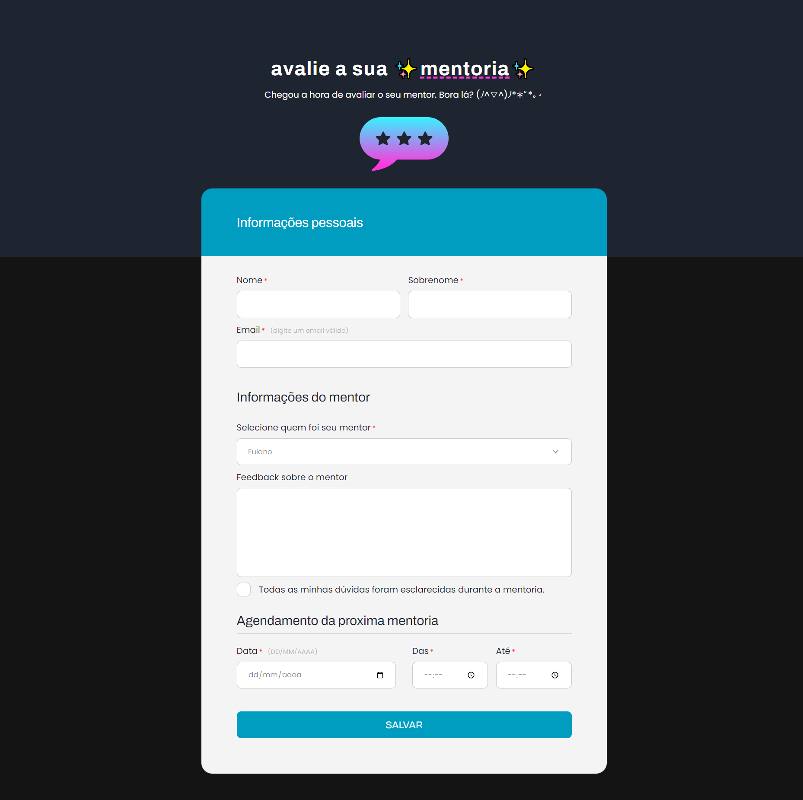

# Desafio 3: Aula 03 | Rocketseat Explorer 🚀

Desafios normal e avançado da Aula 3 do curso [Explorer](https://app.rocketseat.com.br/explorer) da Rocketseat.
O explorer é um curso full-stack que ensina a programar desde o nível mais básico.
Nestes desafios, a proposta era recriar layouts de formulários -- um simples e outro mais complexo.
  
🔗 [Clique aqui para ver o desafio normal](https://mariak-fla.github.io/desafio3-RS/normal)
 
🔗 [Clique aqui para ver o desafio avançado](https://mariak-fla.github.io/desafio3-RS/avancado)

## ⚙️ Tecnologias

- HTML
- CSS
- Git
- Github